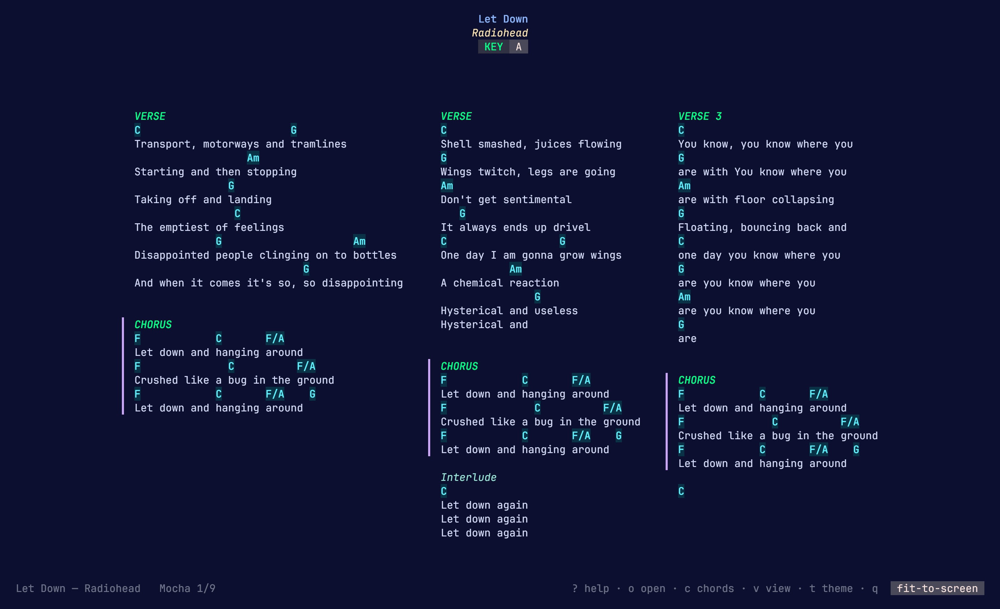
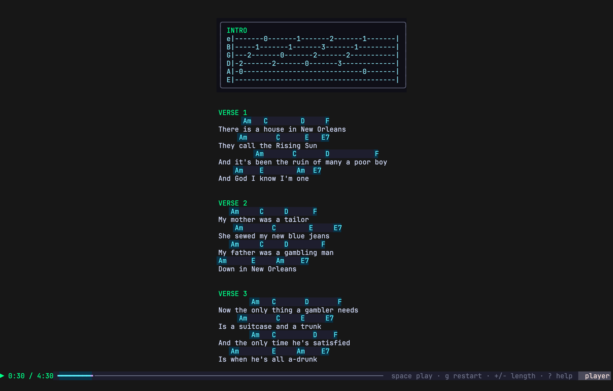
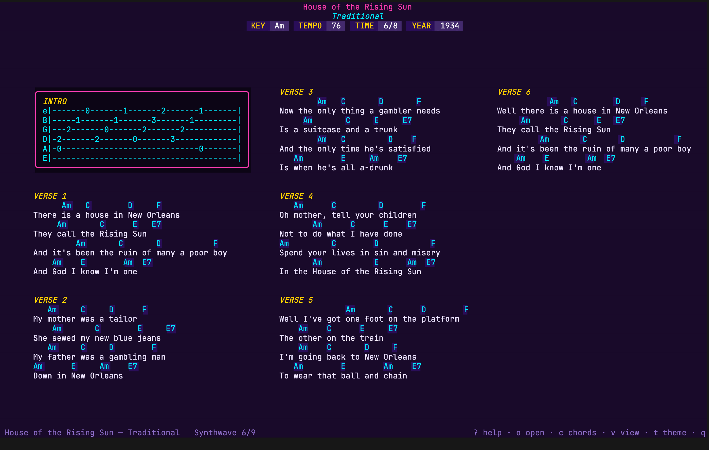
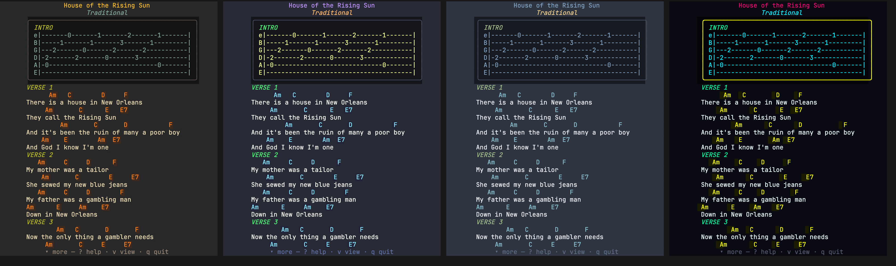
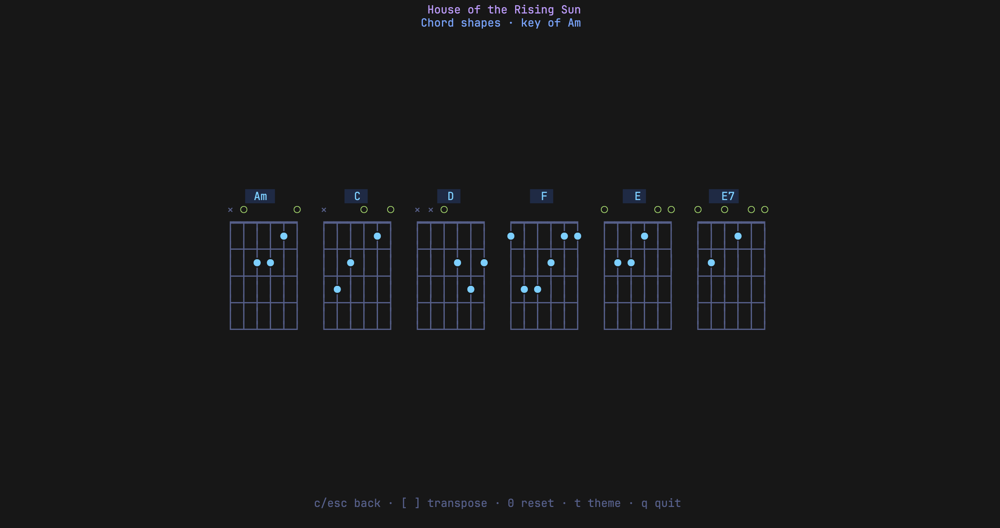
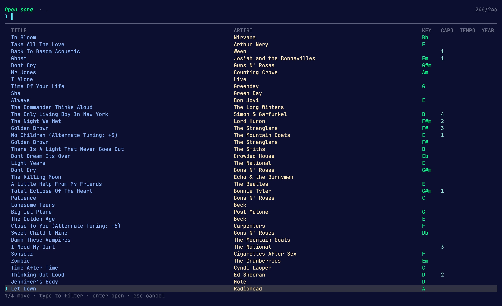

# chordpro-tui

A colorful terminal renderer for [ChordPro](https://www.chordpro.org/) song
files that fits the **whole song on one screen**.

Most chord apps assume you'll scroll — they paginate long charts or crawl the
lyrics past you on a timer, and mid-song is exactly when you don't have a hand
free. chordpro-tui starts from the opposite idea: lay the entire song out at
once — chords stacked over lyrics, flowing into balanced newspaper columns —
so you glance instead of scroll. Auto-scroll views exist for when you want
them, but they're the fallback, not the premise.



## Features

- **One-screen fit layout** — the song is split into section blocks and packed
  into however many columns fill your terminal best; short songs are centered,
  long ones flow wider. No pagination, no scrolling mid-song.
- **Teleprompter & player modes** — when you do want motion: auto-scroll at a
  tempo-derived speed, or pace the whole song against its `{duration}` with a
  play/pause progress bar.
- **Live transpose** — `[` / `]` shift every chord (and the key) a semitone,
  with lead-sheet accidental spelling; `w` saves a transposed copy of the file
  with formatting preserved.
- **Chord-shape sheet** — press `c` for fingering diagrams of every chord in
  the song; `{define}` directives override the built-in shapes.
- **Fuzzy song finder** — browse a whole folder of charts with title/artist
  filtering and metadata columns, or jump with next/previous/random keys.
- **9 themes** — Mocha, Tokyo Night, Gruvbox, Dracula, Nord, plus a neon set
  (Synthwave, Cyberpunk, Laser, Vapor), with an optional full background fill.
- **`$EDITOR` round-trip** — hit `e`, edit the chart, and it reloads in place
  with your transpose and theme intact.
- **One-page PDF export** — a sibling `chordpro-pdf` binary renders the same
  fit layout to a device-sized PDF (iPad, iPhone, Mac, A4/Letter), chord
  diagrams included.
- Foldable tablature panels, TOML config with tri-state auto-hide options,
  stdin/pipe support, and a `--print` mode for scripting and screenshots.

## Install

```sh
go install github.com/monomadic/chordpro-tui@latest
go install github.com/monomadic/chordpro-tui/cmd/chordpro-pdf@latest   # one-page PDF exporter
```

Both land in `$(go env GOPATH)/bin` — add that to your `PATH` if it isn't already.

Or build from a clone:

```sh
go build -o chordpro-tui .
go build -o chordpro-pdf ./cmd/chordpro-pdf
```

Requires Go 1.26+ and a truecolor terminal for the full palette.

## Usage

```sh
# Interactive (default when stdout is a terminal)
chordpro-tui testdata/wagon_wheel.cho

# Point at a folder to open its most recently modified song
chordpro-tui testdata/

# Start straight into auto-scroll teleprompter mode
chordpro-tui --scroll testdata/wagon_wheel.cho

# Transpose up 2 semitones, pick a theme
chordpro-tui --transpose 2 --theme "Tokyo Night" testdata/wagon_wheel.cho

# Render once and exit (good for piping / screenshots)
chordpro-tui --print testdata/wagon_wheel.cho
chordpro-tui --print --width 120 --height 40 testdata/wagon_wheel.cho

# Read from stdin
chordpro-tui < testdata/wagon_wheel.cho

# Write a documented default config to ~/.config/chordpro-tui/chordpro-tui.toml
chordpro-tui --init-config

# ...or print it to stdout to redirect yourself
chordpro-tui --print-config
```

### Keys (interactive)

| Key              | Action                                            |
| ---------------- | ------------------------------------------------- |
| `?`              | show all keyboard shortcuts                       |
| `o`              | open another song from this folder (fuzzy finder) |
| `e`              | edit the current file in `$EDITOR`                |
| `n` / `p`        | load next / previous song in the folder           |
| `r`              | load a random song in the folder                  |
| `v`              | cycle view mode: **fit → scroll → player**        |
| `T`              | fold / unfold tab sections                        |
| `c`              | chord-shape sheet for the current song            |
| `t`              | cycle color theme                                 |
| `B`              | toggle themed background fill                      |
| `h`              | toggle the title header                            |
| `[` / `]`        | transpose down / up (fit mode)                    |
| `0`              | reset transpose                                   |
| `w`              | save a transposed copy alongside the original     |
| `space`          | pause/resume scroll · play/pause sync             |
| `+` / `-`        | scroll speed (scroll) · song length (sync)        |
| `↑`/`↓`, `j`/`k`, `^n`/`^p` | scroll a line / seek the timeline       |
| `f`/`b`, PgDn/PgUp | scroll a page                                   |
| `g` / `G`        | jump to top / bottom (`g` restarts sync)          |
| `q`              | quit                                              |

Press `?` any time for an on-screen overlay of all of these.

### View modes

`v` cycles the three views, and the active one is always shown as a badge in the
bottom-right corner.

- **Fit** (`fit-to-screen`) — the whole song laid out to fill one screen (see
  below). Because everything is already on screen, the line-scroll keys
  (`↑`/`↓`, `j`/`k`, `^n`/`^p`) do nothing here by design; they come alive in the
  two scrolling views.
- **Scroll** (`auto-scroll`) — a teleprompter that auto-scrolls at a constant,
  tempo-derived speed you can nudge with `+`/`-`.
- **Sync** (`player`) — scrolls so the last line lands exactly at the end of the
  song. Reads a `{duration: mm:ss}` directive (defaults to 3:30, adjustable with
  `+`/`-`); `space` plays/pauses and a progress bar shows elapsed / total.



Tab (`{start_of_tab}`) sections are drawn as a dark inset panel — a filled
near-black block with the section label as its title bar — so tablature reads
apart from the lyrics. `T` folds those sections away in any view, so a chart
with long tablature blocks collapses to just its chords and lyrics; press `T`
again to bring them back. It overrides `collapse-tablature-sections` in both
directions, so `T` unfolds tabs that the config folds by default.



### Transpose & themes

`[` / `]` shift every chord (and the key) by a semitone; slash-chord bass notes
move too. Accidentals use the spelling most commonly seen on lead sheets, fixed
per note rather than by key: **E♭** and **B♭** are flats, while **C♯**, **F♯**
and **G♯** are sharps (so you get B♭ over A♯ but F♯ over G♭, and E/G♯ stays
sharp). The current key pill shows the transpose offset (e.g. `Bb +3`). `t`
cycles the bundled themes — **Mocha, Tokyo Night, Gruvbox, Dracula, Nord** plus
the neon set **Synthwave, Cyberpunk, Laser, Vapor** — and the footer shows the
active theme (with its position in the cycle, e.g. `Synthwave 6/9`).

`w` **saves a transposed copy** next to the original file: the chords and `{key}`
are written out shifted by the current transpose, the title gains an
`(Alternate Tuning: +N)` suffix, and the new filename echoes it
(`Stolen Car - Beth Orton (Alternate Tuning +1).cho`). The rest of the file —
comments, `{define}`s, tab blocks, annotations and formatting — is preserved
verbatim. (Custom `{define}` shapes are kept as written; see the transpose
caveat above.) A confirmation shows briefly on the bottom row.

`B` toggles a **themed background fill** (also `--bg`): instead of the terminal's
default background, the whole screen is painted with the theme's background
color, with chord and metadata pills still standing out on top. Best with a
truecolor terminal.



To preview every theme at once, run `scripts/gallery.sh` (add `--bg` to see the
backgrounds, pass a song path to use your own): it renders the song in each
theme back-to-back with colors forced on.

### Chord-shape sheet

`c` opens a fingering-diagram sheet for every chord the current song uses —
open/muted string markers included — and it follows the live transpose, so
`[` / `]` re-spell the shapes on the spot. `{define}` directives in the song
override the built-in shapes, and a `{tuning}` directive is shown alongside.



### Opening, browsing & editing songs

Pass a **folder** instead of a file and the most recently modified song in it
opens (handy for "show me the chart I just saved"); the rest of the folder is
then a keypress away.

`o` opens a fuzzy finder over every ChordPro file
(`.cho .chopro .chordpro .crd .pro .cp`) in the current song's folder. Rows are
laid out in labelled columns — **title, artist, key, capo, tempo, year** (the
metadata columns drop off, narrowest first, on small terminals) and file
extensions are hidden. Type to filter by **title or artist** (matched characters
are highlighted in whichever column they fall), `↑`/`↓` to move, `enter` to open,
`esc` to cancel.



Without opening the finder you can also jump straight between songs in the
folder: `n` / `p` for next / previous (wrapping) and `r` for a random pick. The
order (used by both `n`/`p` and the unfiltered finder list) follows the
`sort-songs` config option below. Switching songs resets transpose and playback
but keeps your theme.

`e` opens the current file in `$EDITOR` (falling back to `vi`); when you quit the
editor the song is reloaded automatically, preserving your transpose and theme.

## Configuration

Optional settings live in a small TOML file. Run `chordpro-tui --init-config` to
drop a documented default at `~/.config/chordpro-tui/chordpro-tui.toml` (respects
`$XDG_CONFIG_HOME`), or `--print-config` to write it yourself. It's loaded from
that user-wide path, from a project-local `./chordpro-tui.toml` (which takes
precedence), or from any `--config PATH`. On macOS both `~/.config/chordpro-tui/`
and `~/Library/Application Support/chordpro-tui/` are searched.

Most display options are **tri-state** — `true` (always), `false` (never), or
`auto` (apply only when the song would otherwise overflow the fit-view screen; in
scroll and player views there is always room, so `auto` behaves as `false`). When
several `auto` options are set, space is reclaimed from the least disruptive first:
section spacing, then the page title collapses to one line, then tabs fold, then
the metadata pills drop, and only last the title itself.

| Key                           | Values              | Effect                                                              |
| ----------------------------- | ------------------- | ------------------------------------------------------------------- |
| `collapse-tablature-sections` | true / false / auto | fold away tab (tablature) sections                                  |
| `autohide-song-title`         | true / false / auto | hide the title + artist line                                        |
| `autohide-song-info`          | true / false / auto | hide the metadata pills (KEY, CAPO, …)                              |
| `autohide-section-titles`     | true / false        | hide all section labels (CHORUS, VERSE, …)                          |
| `collapse-page-title`         | true / false / auto | lay title, artist, and metadata out on one line                     |
| `collapse-section-title`      | true / false / auto | blank row above each section label (`auto` drops it only if cramped) |
| `sort-songs`                  | none / name / date  | song-queue order: directory order, by title, or newest-first        |

Config sets the defaults; the `h` (hide header) and `T` (fold tabs) keys still
toggle at runtime, and `T` overrides a configured fold in either direction.

## PDF export (`chordpro-pdf`)

`chordpro-pdf` renders the same one-page fit layout to a PDF for offline use on
a phone, tablet, or desktop — monochrome sheet-music style: a bold sans title
block, **fingering diagrams for every chord the song uses** (with o/x string
markers, starting-fret notes, and finger numbers), italic section labels, and
chords stacked bold over the lyrics. The song always lands on **exactly one
page**: short songs get large centered type (capped at `--max-font`), long
songs flow into balanced columns at smaller sizes.

<p align="center">
  
</p>

```sh
chordpro-pdf song.cho                             # → "song (iPad Mini).pdf"
chordpro-pdf --preset iphone song.cho             # → "song (iPhone).pdf"
chordpro-pdf --preset mac --inverted song.cho     # 16:10 desktop, night mode
chordpro-pdf --preset a4 --transpose 2 song.cho   # paper, transposed
chordpro-pdf --page 800x600 --columns 2 song.cho  # custom size (points), 2 columns
chordpro-pdf --list-presets
```

Output defaults to `<input> (<Preset>).pdf` — e.g.
`Wagon Wheel - Old Crow (iPad Mini).pdf` — so exports for different devices
sit side by side (override with `-o`/`--output`). Device presets (`ipad-mini`,
`ipad`, `iphone`, `mac`) use the device's logical point resolution, so the
page's aspect ratio matches the screen exactly — a full-screen PDF viewer
shows the song edge-to-edge with no letterboxing. `a4`/`letter` cover paper;
`--landscape`/`--portrait` turn any preset, and `--page WxH` sets an arbitrary
size in points. Diagrams honor a song's `{define}` fingerings and follow
`--transpose`; `--no-diagrams` drops the row. `--inverted` flips the page to
white-on-black for reading in the dark. Type is Helvetica throughout
(`--serif` swaps the lyric voice to Times), core PDF fonts only, so files are
tiny and open anywhere.

## Layout behaviour

- **Fits when it can.** The song is split into atomic section blocks (verses,
  choruses, …) that flow top-to-bottom into as many columns as needed to stay
  within the screen height — but never more columns than fit the width, so it
  never overflows sideways.
- **Centers when it's small.** A short song is centered vertically and
  horizontally on the page.
- **Scrolls when it can't.** A song too big for any single-screen layout falls
  back gracefully; press `v` for the auto-scrolling teleprompter.

## Supported ChordPro

Directives: `title`/`t`, `subtitle`/`st`, `artist`, `composer`, `album`, `key`,
`capo`, `tempo`, `bpm`, `time`/`time_signature`, `year`, `tuning`,
`duration`/`length`, `comment`/`c`/`comment_italic`/`comment_box`/`highlight`,
`define`, and the `start_of_*`/`end_of_*` (and `soc`/`sov`/`sob`/`sot`/`soi`/`soo`/`sos`)
environments for choruses, verses, bridges, tab blocks, intros, outros, and
generic sections. Inline `[chord]` markup is positioned over the syllable that
follows it.

- Each section prints a default heading (`VERSE`, `CHORUS`, `BRIDGE`, `TAB`,
  `INTRO`, `OUTRO`, `SECTION`). A directive's argument may be a bare value
  (`{start_of_verse: Verse 1}`) or HTML-style attributes
  (`{start_of_verse: label="Verse 1"}`, single or double quotes, with or without
  the colon); a `label=` (or bare argument) replaces the default heading text.
  `{start_of_section: Intro}` is a generic labelled section.
- `[*…]` brackets are **annotations** (`[*Riff x2]`, `[*N.C.]`): the `*` is
  dropped and the text is shown in the chord position verbatim — never
  transposed or drawn as a chord shape.
- `bpm` drives the scroll/sync speed; when both are present `bpm` wins and the
  TEMPO pill shows it, so a word `tempo` like `Allegro` doesn't break pacing.
- `define` chord fingerings override the built-in shapes in the chord sheet
  (`c`); `tuning` is shown there too.
- `{chorus}` **recalls** (re-inserts) the most recent preceding chorus, so a
  repeated chorus needn't be copy-pasted. `{chorus: Label}` (or
  `label="…"`) re-labels the recalled copy; a bare `{chorus}` keeps the
  original chorus's heading. A `{chorus}` with no preceding chorus is ignored.
- Blank lines **inside** a `start_of_*`/`end_of_*` block are kept as spacing;
  loose (un-bracketed) paragraphs still split on blank lines.

Unknown directives are ignored; `#` lines are source comments. Conditional
selectors (`{comment-guitar: …}`), `{transpose}`, grids, and non-European note
systems are not yet interpreted.

## Project layout

```
main.go                      terminal renderer: CLI entry, TTY detection, flags
cmd/chordpro-pdf/            one-page PDF exporter CLI
internal/chordpro/           parser + song model + transpose
internal/render/             themes, chord/lyric alignment, column packing (TUI)
internal/pdf/                PDF page layout + drawing (device presets)
internal/tui/                Bubbletea model (fit / scroll / sync) + file picker
scripts/gallery.sh           render the sample song in every theme
testdata/                    example songs
```

## Theming

The palette lives in `internal/render/theme.go` (default: Catppuccin Mocha).
Swap the `Palette` values to reskin every style at once.
